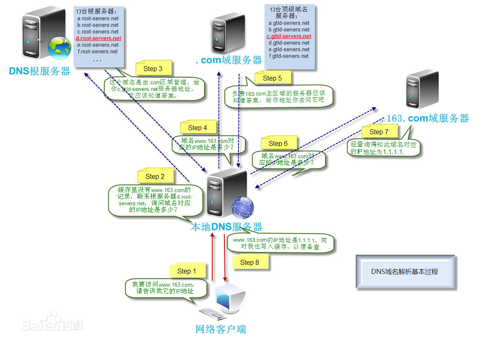
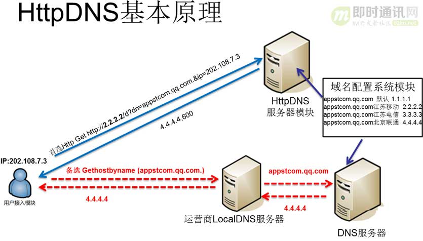

# HttpDNS 在 iOS 上的实现方案

## 前言

最近在公司做网络相关的优化，重新整理了下之前对 HttpDNS 的认知并编写了本编文章，以自建 HttpDNS 方案为基准，讲解实际的移动端接入代码，由于每个人的实现方案都有所不同，这里只是抛转引玉，不一定适合所有项目。

## 介绍

当我们发起一个有域名的请求时，需要先经过 DNS 解析成 IP 地址再发起请求，所以 DNS 的域名解析的稳定性很关键，是网络请求的第一步。

### 域名解析流程

默认情况下，域名都是先经过运营商的 LocalDNS 查询，例如电信用户查询的就是电信的 LocalDNS，移动用户查询的是移动的 LocalDNS，通常两者之间解析的 IP 地址是不相同的。

LocalDNS 未命中再转发到权威 DNS 服务器上，以访问 www.163.com 为例，先找寻 DNS根服务器 获取 .com 域服务器的地址，再查询 .com 服务器得到 163.com 域服务器地址，最后通过 163.com 域服务器得到准确的 IP 地址，并缓存到 LocalDNS 服务器中。

整体流程如下图：



> 更多关于 DNS 内容可查看 [DNS 原理入门 - 阮一峰的网络日志](http://www.ruanyifeng.com/blog/2016/06/dns.html)

### LocalNDS带来的问题

随着 App 不同地区和运营商的用户不断扩大，经常会出现无法访问或者访问慢的问题，经过定位发现了以下问题。

#### LocalDNS 故障

运营商服务器故障，无法向权威服务器发起递归查询，导致解析失败。

#### DNS 劫持

第三方劫持了 DNS 服务器，篡改了解析结果，使客户端访问错误 IP 地址，实现资料窃取或恶意访问。

#### DNS 解析通过缓存返回

LocalDNS 缓存了之前的解析结果，当再次收到解析请求时不再访问权威 DNS 服务器，从而保证用户访问流量在本网消化或插入广告。如果权威服务器的 IP 或端口发生改变时，LocalDNS 未更新会导致访问失败。

#### 小运营商的解析转发

小运营商为了节省资源考虑，不向权威 DNS 服务器发起解析，而直接将请求发送到其他运营商进行递归解析，造成跨网访问，使用户访问变慢。

### 什么是 HttpDNS

由于 LocalDNS 存在种种问题而且不可控，是否可以绕过它自己进行解析？答案是肯定，通过在自己服务器维护一套域名与 IP 的映射关系，不再经过 LocalDNS 的 53 端口进行 DNS 解析，而是直接向自己服务器的 80 端口发起 HTTP 请求来获取 IP，再通过 IP 直接进行网络请求，这种方式便是 HttpDNS。

发起业务请求的步骤：

1. 客户端直接访问 HttpDNS 接口，获取与该业务请求的域名匹配的最优 IP 地址反馈给客户端。
2. 客户端向获取到的 IP 后就向直接往此IP发送业务协议请求。以 Http 请求为例，通过在 header 中指定 host 字段，向 HttpDNS 返回的IP发送标准的Http请求即可。
3. 基于容错的考虑，保留 LocalDNS 请求方式作为备用方案。




### HttpDNS 优点

- 由于不再向 LocalDNS 发起解析，从根本上**避免了DNS劫持**。
- 直接通过 IP 访问，省了了域名解析过程，**提升用户访问速度**。
- 可在自己服务器通过算法对 IP 请求成功率高低的进行排序，筛选出优质 IP，**增加了请求的成功率**。


## iOS 端的实现

HttpDNS 整体方案需要服务器和移动端互相配合，在移动端主要是对网络请求进行封装，替换域名请求，做到对用户无感知，做好缓存和容错处理，并对成功/失败请求记录日志上传到服务器；服务器则需要维护域名与 IP 映射关系表并提供下发接口，并通过客户端日志进行优化排序。

接下来我们探讨一些实现的关键步骤。

### 服务器下发 IP 配置

在 App 启动时或者合适的时间向服务器请求配置表，这里的请求可以用固定 IP 替代域名，免去域名解析的过程。这里要注意的点是，如果使用 IP 请求，**需要在 header 指定 host 字段**。

```objective-c
NSString *host = "a.test.com";
[request setValue:host forHTTPHeaderField:@"Host"];
```

具体下发的配置表格式根据实际需求而定即可，例如：

```json
{
    service = "深圳移动";
    domainlist =     [
                {
            domain = "a.test.com";
            ips =             [
                "222.66.22.111",
  							"222.66.22.102",
            ];
        },
                {
            domain = "b.test.com";
            ips =             [
                "202.29.13.214"
            ];
        },
				...
				...
    ];
    enable = 1;
}
	
```

### 封装网络请求

这里使用的网络框架 `AFNetworking`，我们的封装是基于该框架进行的。与普通的网络请求封装区别于需在正式发起请求前先用 IP 替代域名。

```objective-c


```


1. 成功请求&埋点
2. 失败降级处理&埋点

ALDNetworkService 139


https://juejin.im/post/5e0d580b5188253a5c7d12fc#heading-8

https://juejin.im/post/58feef7261ff4b0066776d73#heading-28


### 缓存策略

### 解决 HTTPS 证书校验问题

自从苹果推行 HTTPS 后，已成功客户端的基本网络请求协议。

Host公钥加密，ip发送请求，服务端ip接口请求，ip解析成host，用host私钥解析

如果ip存在一对多证书（SNI）会有问题，

相关代码：ALDSessionManager 200行

https://www.jianshu.com/p/1839c6985c14

https://www.jianshu.com/p/66ffa9b69c17

https://www.jianshu.com/p/59d1cbf34d67

### 容错处理

降级访问

### 总流程图

请求流程

安全校验流程

http://www.52im.net/thread-2121-1-1.html

http://www.52im.net/thread-2172-1-1.html

http://www.52im.net/thread-2472-1-1.html

### WKWebView和AVPlayer处理HTTPDNS

## CDN 拓展方案

### 什么是cdn

### SNI是什么

### 作为httpdns的降级方案接入

```json
{
    service = "深圳移动";
    domainlist =     [
                {
            domain = "a.test.com";
            ips =             [
                "222.66.22.111",
  							"222.66.22.102",
            ];
        },
                {
            domain = "b.test.com";
            ips =             [
                "202.29.13.214"
            ];
        },
								{
            cdn = 1;
            cdnSource = "cdna.test.com";
            domain = "a-static.test.com"
            ips =             [
            ];

        },
                {
            cdn = 1;
            cdnSource = "cdnb.test.com.";
            domain = "css.test.com";
            ips =             [
            ];

        },
				...
				...
    ];
    enable = 1;
}
```


## 总结


### 参考链接

- [【鹅厂网事】全局精确流量调度新思路-HttpDNS服务详解](https://mp.weixin.qq.com/s?__biz=MzA3ODgyNzcwMw==&mid=201837080&idx=1&sn=b2a152b84df1c7dbd294ea66037cf262&scene=2&from=timeline&isappinstalled=0&utm_source=tuicool)
- [可能是最全的iOS端HttpDns集成方案 | 掘金技术征文 - 掘金](https://juejin.im/post/58feef7261ff4b0066776d73#heading-14)
- [App域名劫持之DNS高可用 - 开源版HttpDNS方案详解](https://mp.weixin.qq.com/s?__biz=MzAwMDU1MTE1OQ==&mid=209805123&idx=1&sn=ced8d67c3e2cc3ca38ef722949fa21f8&3rd=MzA3MDU4NTYzMw==&scene=6#rd&utm_source=tuicool&utm_medium=referral)
- [全面理解DNS及HTTPDNS - 掘金](https://juejin.im/post/5dc14f096fb9a04a6b204c6f)
- [解决「HTTPDNS + HTTPS」的证书校验问题 - https- - ItBoth](http://www.itboth.com/d/INbqqy/https)
- [CDN是什么？与DNS有什么关系？及其原理_运维_hetoto的博客-CSDN博客](https://blog.csdn.net/hetoto/article/details/90509328)
- [APP网络优化之DNS优化实践 - 掘金](https://juejin.im/post/5e0d580b5188253a5c7d12fc)

